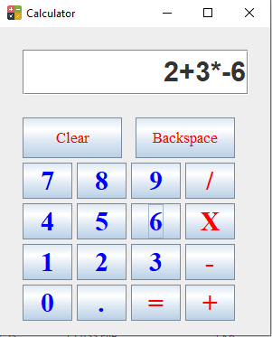

# Calculator
__A simple calculator compatible with float data type, supporting operations- Multiplication, Division, Addition, Subtraction; following precedence and associativity rules.__

_Example of a calculation: (2+(3*(-6))) = -16_

  

_Representing Errors_

  

